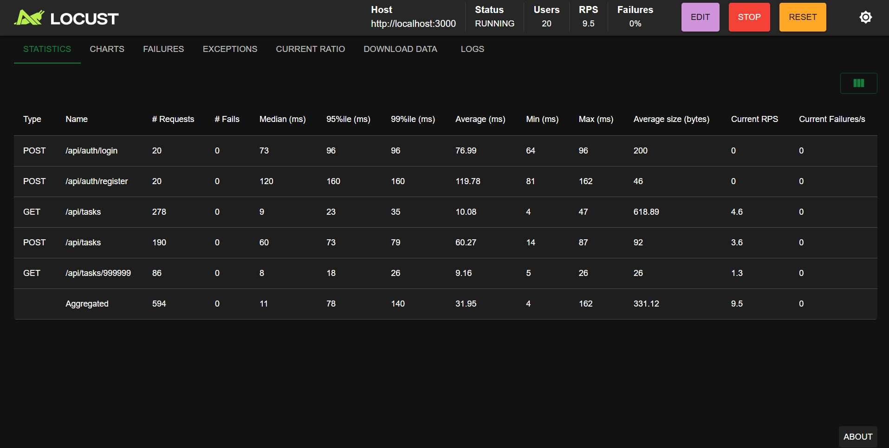

# Task Manager API

A REST API for task management with JWT authentication, built with Express.js and SQLite. Includes a full Postman/Newman test suite, Docker containerization, and a CI/CD pipeline with GitHub Actions.

## Endpoints

### Auth

| Method | Endpoint            | Description                    |
|--------|---------------------|----------------------------------|
| POST   | /api/auth/register  | Register a new user             |
| POST   | /api/auth/login     | Log in and receive a JWT token  |

### Tasks (require Authorization: Bearer <token>)

| Method | Endpoint          | Description                        |
|--------|-------------------|--------------------------------------|
| GET    | /api/tasks        | Get all tasks for the logged-in user |
| GET    | /api/tasks/:id    | Get a task by id                     |
| POST   | /api/tasks        | Create a new task                    |
| PUT    | /api/tasks/:id    | Update a task                        |
| DELETE | /api/tasks/:id    | Delete a task                        |

## Tech stack

- Node.js + Express
- SQLite (file-based database)
- JWT authentication (jsonwebtoken)
- Password hashing (bcrypt)
- Postman + Newman (automated API testing, 19 assertions across 9 requests)
- Docker (containerized deployment)
- GitHub Actions (CI/CD pipeline running the full test suite on every push)

## Security

- Passwords are hashed with bcrypt before being stored, never saved in plain text
- All task routes are protected by JWT authentication middleware
- Tasks are private per user: every query is scoped to the authenticated user's id, so users cannot view or modify tasks that are not theirs, even if they guess a task id

## How to run it locally

npm install
npm run dev

The server runs on http://localhost:3000

## How to run it with Docker

docker build -t task-manager-api .
docker run -p 3000:3000 --name task-manager-container task-manager-api

## How to run the test suite

With the server running, in a separate terminal:

npm install --save-dev newman
npx newman run "Task Manager API.postman_collection.json" --env-var "base_url=http://localhost:3000"

## CI/CD

Every push to `main` automatically triggers a GitHub Actions workflow that installs dependencies, starts the server, and runs the full Postman/Newman test suite. See `.github/workflows/api-tests.yml`.

## Test coverage

- User registration and login
- Create task (success + missing title validation)
- Get all tasks
- Get task by id (success + not found)
- Update task
- Delete task
- Access denied without a valid token

19/19 assertions passing across 9 requests, covering authentication, the happy path, and error handling.

## Author

Camila Molina Toro, Systems Engineering student (UPB), focused on QA and software development.

LinkedIn: https://www.linkedin.com/in/camilamolinatoro

GitHub: https://github.com/camimolinatoro
## Load Testing (Locust)

The API was load-tested with Locust, simulating 20 concurrent users performing realistic actions: registering, logging in, listing tasks, creating tasks, and requesting a nonexistent task.

Results with 20 concurrent users:
- 259 total requests, 0% failure rate
- Median response time: 15ms
- 99th percentile: 140ms

To run it:

pip install locust
locust -f locustfile.py --host=http://localhost:3000

Then open http://localhost:8089, set the number of users and ramp-up rate, and start the test.
